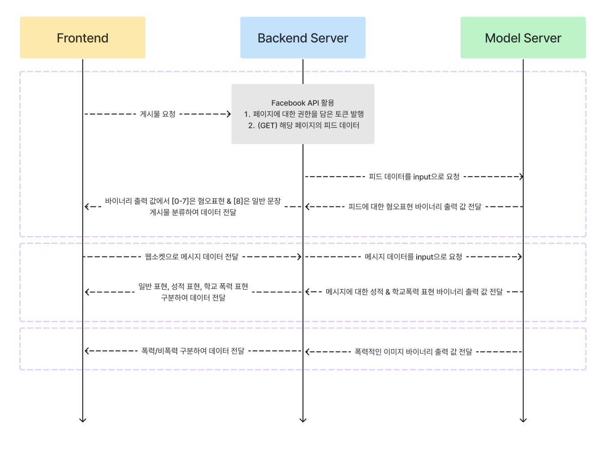

Cleans (클린즈)
=======
### 이 프로젝트는 폭력적인 언어에 무방비하게 노출되는 아동·청소년들을 위한 SNS 필터링 프로그램이다.</span>


본 서비스는 학습된 데이터, 백엔드와 연결하여 도출된 결과를 출력, React를 사용해 UI를 제작, 디자인한다.

## 목차
- [개요](#개요)
- [기술스택](#기술스택)
- [아키텍처](#아키텍처)
- [주요 기능](#주요-기능)
- [설치 방법](#설치-방법)
- [라이센스](#라이센스)

<br>

## 개요
- 프로젝트 이름 : Clens
- 프로젝트 gitHub
    - FrontEnd : https://github.com/TwitFilterProject/TFP-FE
    - BackEnd : https://github.com/TwitFilterProject/TFP-BE
    - HateBertModel : https://github.com/TwitFilterProject/TFP-Bert-Hate
    - SexualBertModel : https://github.com/TwitFilterProject/TFP-Bert-Sexual
    - ViolentImgModel : https://github.com/TwitFilterProject/TFP-ResNet-Violence
- 프로젝트 목표 : 아동 청소년이 혐오적, 선정적, 폭력적 텍스트 혹은 이미지에 노출되지 않도록 깨끗한 SNS를 제공</span>
- 프로젝트 인원 : 4명
- 프로젝트 기간 : 2024년 5월 12일 - 2024년 6월 21일


## 기술스택
- FrontEnd : React
- BackEnd : NestJS
- Model : Python, Tensorflow

## 아키텍처


## 주요 기능
1) Main page : Facebook api를 통해 불러와진 데이터 중 혐오 발언이 포함된 문구를 가리고 Main 화면에 배치한다.
2) 닉네임을 입력 후 채팅방 입장하면 웹소켓이 연결되고, 같은 서버에 있는 사용자들끼리 자체 채팅이 가능하다. 입장 후 채팅을 보내면 폭력적이거나 선정적인 경우 문구를 가린다.
3) 폭력적인 이미지를 구별한다.


## 설치 방법

1. 레포지토리를 클론합니다.
    ```bash
    git clone https://github.com/TwitFilterProject/TFP-FE.git
    cd TFP-FE
    ```
    
2. 필요한 패키지를 설치합니다.
    ```bash
    npm install
    ```

3. 서비스를 실행합니다
   ```bash
    npm start
    ```
   
## 라이센스

**React**
MIT License

Copyright (c) 2024 김서윤


Permission is hereby granted, free of charge, to any person obtaining a copy
of this software and associated documentation files (the "Software"), to deal
in the Software without restriction, including without limitation the rights
to use, copy, modify, merge, publish, distribute, sublicense, and/or sell
copies of the Software, and to permit persons to whom the Software is
furnished to do so, subject to the following conditions:


The above copyright notice and this permission notice shall be included in all
copies or substantial portions of the Software.


THE SOFTWARE IS PROVIDED "AS IS", WITHOUT WARRANTY OF ANY KIND, EXPRESS OR
IMPLIED, INCLUDING BUT NOT LIMITED TO THE WARRANTIES OF MERCHANTABILITY,
FITNESS FOR A PARTICULAR PURPOSE AND NONINFRINGEMENT. IN NO EVENT SHALL THE
AUTHORS OR COPYRIGHT HOLDERS BE LIABLE FOR ANY CLAIM, DAMAGES OR OTHER
LIABILITY, WHETHER IN AN ACTION OF CONTRACT, TORT OR OTHERWISE, ARISING FROM,
OUT OF OR IN CONNECTION WITH THE SOFTWARE OR THE USE OR OTHER DEALINGS IN THE
SOFTWARE.

